# Diagrama de Sequência: Orquestração do Pipeline

Abaixo está a representação visual de como a classe `AnalysisPipeline` coordena os serviços de IA e a interface do usuário (Streamlit) de forma desacoplada.

```mermaid
sequenceDiagram
    autonumber
    participant U as Usuário (Browser)
    participant A as app.py (Maestro)
    participant P as AnalysisPipeline
    participant H as StreamlitUIHandler
    participant M as MistralService (Stage 1)
    participant O as OpenAIService (Stage 2 & 3)
    participant G as PDFGenerator (Stage 4)
    participant D as SQLite (ai_metrics.db)

    U->>A: Clique em "Gerar Análise"
    A->>A: security_choke_point(input)
    
    rect rgb(30, 30, 46)
    Note over A, P: Inicialização do Pipeline
    A->>P: execute(safe_input, cache_keys, params)
    end

    rect rgb(40, 40, 60)
    Note over P, M: Stage 1: Contexto
    P->>H: on_stage_start(1, "Contexto...")
    H-->>U: Renderiza st.status ("🧠...")
    P->>M: analyze_context(text)
    M-->>D: record_call (Mistral)
    M-->>P: JSON (ContextAnalysis)
    P->>H: on_stage_update(h1, "Sucesso", "complete")
    end

    rect rgb(40, 40, 60)
    Note over P, O: Stage 2: Métricas
    P->>H: on_stage_start(2, "Métricas...")
    P->>O: generate_metrics(text, context)
    O-->>D: record_call (OpenRouter)
    O-->>P: JSON (MetricsAnalysis)
    P->>H: on_stage_update(h2, "Sucesso", "complete")
    end

    rect rgb(40, 40, 60)
    Note over P, O: Stage 3: Resumo Executivo
    P->>H: on_stage_start(3, "Resumo...")
    P->>O: stream_executive_summary(...)
    O-->>P: Generator (tokens)
    P->>H: handle_stream(generator)
    H-->>U: st.write_stream (Live UI)
    P->>H: on_stage_update(h3, "Sucesso", "complete")
    end

    rect rgb(40, 40, 60)
    Note over P, G: Stage 4: Relatório
    P->>H: on_stage_start(4, "PDF...")
    P->>G: generate_report_with_fallback(data)
    G-->>P: (result_type, bytes, report_id)
    P->>H: on_stage_update(h4, "Pronto", "complete")
    end

    P-->>A: results (state dict)
    
    A->>D: save_snapshot(results)
    A->>U: render_results() & balloons!
```

## Pontos Chave:
1.  **Desacoplamento de UI:** O `AnalysisPipeline` não chama `st.*` diretamente. Ele delega para o `UIHandler`.
2.  **Instrumentação:** Todas as chamadas de IA (Mistral e OpenAI) são gravadas no `ai_metrics.db` de forma transparente.
3.  **Resiliência:** O `PDFGenerator` garante que, mesmo que o motor de PDF falhe, o usuário receba um Markdown (Stage 4 fallback).
4.  **UX Ativa:** O Stage 3 utiliza o `StreamlitUIHandler.handle_stream` para fornecer feedback visual instantâneo (streaming) enquanto o relatório final é preparado.
